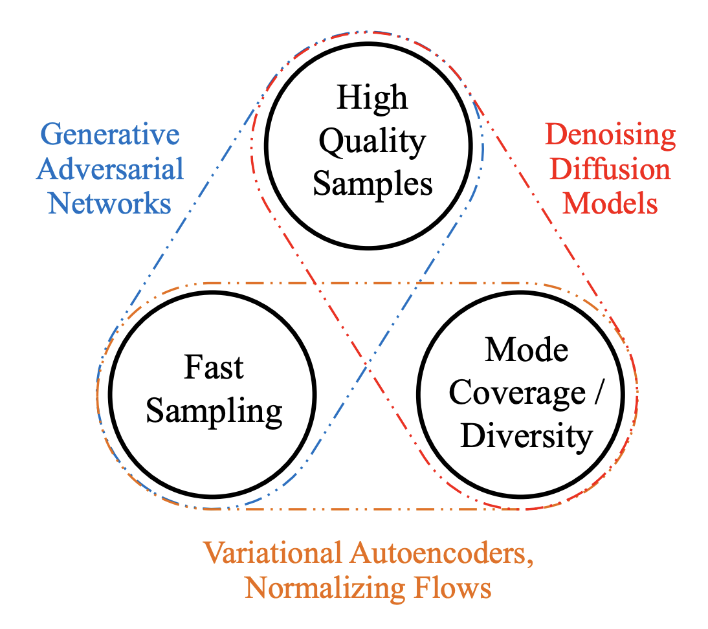
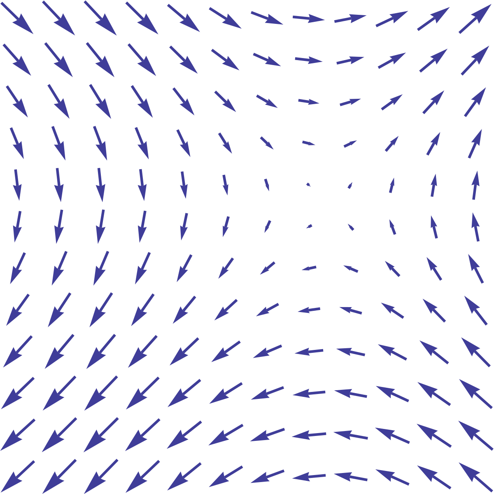
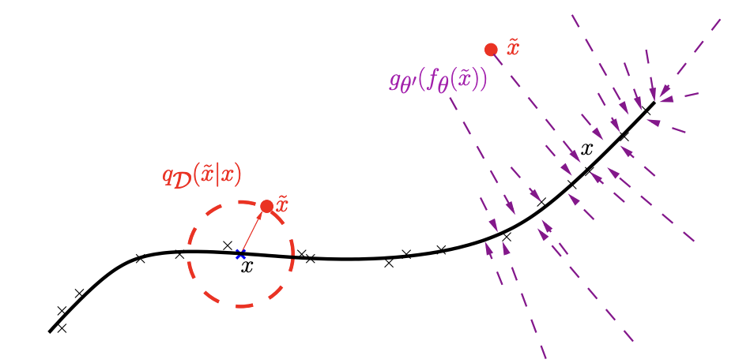
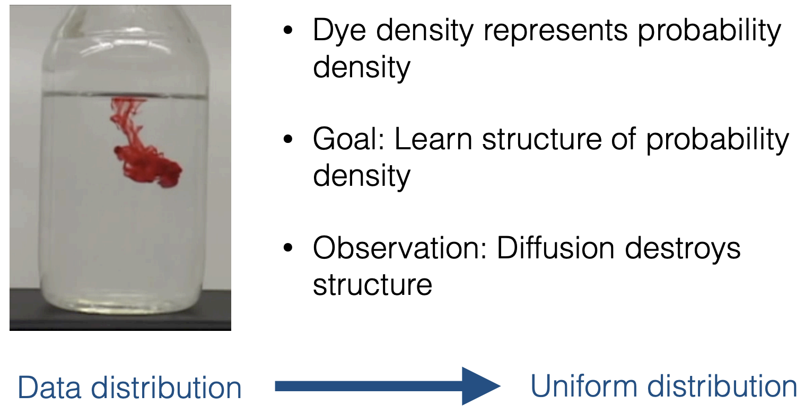
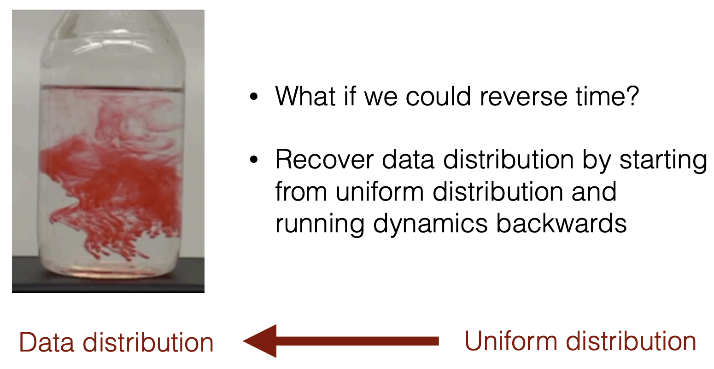

# Diffusion Probalistic Models (WIP)

Diffusion models were first introduced in 2015 with a motivation from non-equilibrium thermodynamics. Later, Ho et al. simplified this model in the paper DDPM, which also points out it resembles the denosing score matching. Song et al. generalized DDPM and their previous work NCSN with continous process and reformulate it with score SDE. They also show that it can be equivalently described by an ODE. Karras et al. rewrite the score SDE by substituting more meaningful terms and unify VP, VE, iDDPM and DDIM.

Overall speaking, the two advantages of diffusion models are: (1) diffusion models are straightforward to define and efficient to train; (2) they are capable of generating high quality samples. Practically, compared to GANs, diffusion models are much easier to train, the loss function is simply MSE loss. On the other hand, the main disadvantage is that it is slow for data generation (sampling). 

Fig.1 - Generative learning trilemma (ref)

In this notebook, we first introduce the two inspirations of diffusion models: denoising score matching and diffusion process. Then we will introduce the generalization of diffusion models into SDE/ODE and reframing it with EDM. And finally, we will include another parameterization framework: VDM. For each part, we share the major insights from the paper. Since our codebase is built upon EDM, we will spend more time explaining this framework. 

## Notations
Data points: $\mathbf{x} _ 0$ \
True distribution: $q(\mathbf{x})$ \
Diffusion steps: $i\in \{1,2,...,N\}$ \
Diffusion time: $t \in [0,1]$ \
Density model with parameters $\theta$: $p_{\theta}(\mathbf{x})$ \
Score networks with parameters $\theta$: $\mathbf{s}_{\theta}(\mathbf{x})$ \
Standard deviation of the Gaussion perturbation kernel: $\sigma(t)$ \
Scaling of the Gaussian perturbation kernel: $s(t)$ 

## Denoising Score Matching with Langevin Dynamics (SMLD)
### Background: Denoising Score Matching

The definition of score, score of data. (to add)

A vector field that points towards higher density of data at a given noise level. The score function does not depend on the intractable normalization term of the underlying density function.

Fig.1 - Score function is a vector field (ref)

**Explicit score matching (ESM):** Encouraging the model to have the same score (gradient of log density function) as the data distribution (at every training point). Given an intractable probabilistic density function  $p_{\theta}(\mathbf{x})=\frac{f(\mathbf{x})}{Z}$. To approximate true distribution $q(\mathbf{x})$, optimize the gradients of log density $\psi_{\theta}(\mathbf{x})=\nabla_{\mathbf{x}}p_{\theta}(\mathbf{x})$ with respect to the true data distribution:

$$
\begin{equation}
J_{SM}(\theta)=\mathbb{E}\_{q(\mathbf{x})}[\frac{1}{2}||s_\theta(\mathbf{x})-\nabla_\mathbf{x}{\log{q(\mathbf{x})}}||^2]
\end{equation}
$$

It can be simplified into a function of $\mathbf{s}_{\theta}(\mathbf{x})$ and gradients of data distribution. However, it's not scalable to DNNs and high dimensional data because of higher order of the gradients of log density.

**Denoising autoencoder (DAE):** Consider a pair of clean and corrupted data $(\mathbf{x},\tilde{\mathbf{x}})$. The joint density of corrupted and uncorrupted samples $q(\tilde{\mathbf{x}},\mathbf{x})=q(\tilde{\mathbf{x}}|\mathbf{x})q_0(\mathbf{x})$. In DAE, ...., optimize the expected squared reconstruction:

$$
\begin{equation}
J_{DAE}(\theta)=\mathbb{E}\_{q(\mathbf{x},\tilde{\mathbf{x}})}[\frac{1}{2}||g_{\theta}(f_{\theta}(\tilde{\mathbf{x}}))-\mathbf{x}||^2]
\end{equation}
$$

this process of mapping a corrupted example to an uncorrupted one can be visualized in Figure 2, where the denoising function $g_{\theta}(f_{\theta}(\tilde {\mathbf{x}}))$ estimates $p(\mathbf{x}|\tilde{\mathbf{x}})$ because $f_{\theta}(\tilde{\mathbf{x}})$ models  $p_{model}(\mathbf{h}|\tilde{\mathbf{x}})$ and $g_{\theta}(\mathbf{h})$ models  $p_{model}(\mathbf{x}|\mathbf{h})$, it means the center of mass of the clean points  $\mathbf{x}$ given its corrupted cluster $\tilde{\mathbf{x}}$. So $g_{\theta}(f_{\theta}(\tilde{\mathbf{x}}))-\mathbf{x}$ learns a vector field pointing towards the manifold $\mathbf{x}$ shown in purple, which is able to estimate the score of the data distribution.

Fig.2 - Denoising Autoencoder (Pascal Vincent et.al. (2008))

**Denoising score matching (DSM):** Inspired by DAE, it's possible to employ paired clean and corrupted data to estimate score of true data distribution. In this way, it will also circumvent computing high order gradients of model score functions (It can also be proved that DSM is equivalent to ESM):

$$
\begin{equation}
J_{DSM}(\theta)=\mathbb{E}\_{q(\mathbf{x},\tilde{\mathbf{x}})}[\frac{1}{2}||\psi(\tilde{\mathbf{x}};\theta)-\nabla_{\tilde{\mathbf{x}}}\log{ q(\tilde{\mathbf{x}}|\mathbf{x})}||^2]
\end{equation}
$$

Particularly, assume an additive Gaussian noise corruption:  $\frac{\partial q(\tilde{\mathbf{x}}|\mathbf{x})}{\partial \tilde{\mathbf{x}}}=\frac{1}{\sigma^2}(\mathbf{x}-\tilde{\mathbf{x}})$, this term indicates moving from noisy data samples to clean samples, and the optimization goal is to match $\psi$ with this gradient. It can also be written as a denoising objective:

$$
\begin{equation}
J_{DSM}(\theta)=\mathbb{E}\_{q(\mathbf{x},\tilde{\mathbf{x}})}[\frac{1}{2}||D_{\theta}(\tilde{\mathbf{x}})-\mathbf{x}||^2]
\end{equation}
$$

### Noise Conditioned Score Networks
**(Manifold hypothesis)** Because the data in real world tend to concentrate on low dimensional manifolds embedded in high dimensional space (ambient space), it brings two challenges to this generative process: (1) undefined score function in ambient space; (2) scarcity of training data in low density region.

To tackle the above mentioned challenges, NCSN proposed to perturb the data with random Gaussian noise of various magnitudes (annealing process), particularly, (1) Gaussian noise distribution is defined in the whole space, not confined to low dimensional manifold; (2) Large Gaussian noise has the effect of filling low density regions in the original unperturbed data distribution.

**Training Objective:**

$$
\begin{equation}
J_{NCSN}(\theta) = \min_\theta
   \sum_{i=1}^{N} \sigma_i^2  \mathbf{E}\_{p_{data}(\mathbf x)}\mathbf{E}\_{p_{\sigma_i}(\tilde{\bf x} \mid {\bf x})}\big[||{{\mathbf s}\_\theta(\tilde{\mathbf x}, \sigma_i)-\nabla_{\tilde{\mathbf x}}\log p_{\sigma_i}(\tilde{\mathbf x}\mid {\mathbf x})}||_2^2 \big]
\tag{1}
\end{equation}
$$

where $\sigma$ is a decreasing geometric sequence. 

**Sampling:**
After the score networks is trained (which can be denoted as ${\bf s}_{\theta^*}$), the data generation step applies annealed Langevin sampling and it involves a double loop, the inner loop is Langevin sampling and the outer loop is the the annealed process on the noise level, from higher level to lower level:

$$
\begin{equation}
{\mathbf x}_i^m = {\mathbf x}_i^{m-1} + \epsilon_i {\mathbf s}\_\theta^*({\mathbf x}_i^{m-1}, \sigma_i) + \sqrt{2\epsilon_i} 
\tag{1}
\end{equation}
$$

where $\epsilon_i$ is the step size, ${\mathbf z}_{i}^m$ is the stand normal, $m$ indicates the Langevin sampling step index and $i$ is the noise level index.

## Denoising Diffusion Probabilistic Models (DDPM)

### Background: Diffusion Probabilistic Models (DPM)
From Jascha

Fig.2 - diffusion process (ref)

A reverse diffusion process:

Fig.3 - reverse diffusion process (ref)

Kolmogorov forward and backward diffusion processes show that for many continuous diffusion processes, the reverse diffusion processes can be described using the ${\color{red} \text{\bf same functional form}}$, such as Gaussian kernel or Binomial Kernel for binary data.

Notice that in diffusion process and the reverse process are both modeled by Markov chains following the ${\color{red} \text{\bf same functional form}}$ In diffusion process: and the mean of Gaussian kernel indicates a decay towards the origin and the std indicates the step of additional noise, while in reverse diffusion process, the mean and std are both learned functions (neural networks). 

In this paper, the authors proposed a deep generative framework to use the forward and reverse ${\color{red} \text{\bf diffusion}}$ process to destruct and construct the data distribution, respectively. The forward/reverse diffusion process are both Markov chains: the forward kernel parameters are fixed, while the reverse kernel parameters are learned. The functional form of the diffusion kernels could be binomial or Gaussian.

### DDPM reparameterization

DDPM discussed the Gaussian kernel case from DPM and reparameterize and simplify the training objective into noise prediction. In later works, we know that there are several ways to interpret the training objectives (See [2], add hyperlink). To better connect with the following SDE and EDM, we temporarily list the score prediction objective.

**Training Objective:**
Alternatively, 

$$
\begin{equation}
J_{DDPM}(\theta)= \min_\theta
    \sum_{i=1}^{N} (1-\alpha_i) \mathbf{E}\_{p_{data}d({\mathbf x})}\mathbf{E}\_{p_{\alpha_i}(\tilde{\mathbf x} \mid \bf x)}[||{{\mathbf s}\_\theta(\tilde{\mathbf x}, i) - \nabla_{\tilde{\mathbf x}} \log p_{\alpha_i}(\tilde{\mathbf x} \mid {\mathbf x})}||_2^2]. 
\tag{3}
\end{equation}
$$

where $\alpha_i$ is and it satsifies:

$$
\begin{equation}
p_{\alpha_i}({\bf x}_i|{\bf x}_0)=\mathcal{N}({\bf x}_i;\sqrt{\alpha_i},(1-\alpha_i){\bf I})
\end{equation}
$$

**Sampling:**
DDPM utilizes ancestral sampling as the diffusion process is a Markov chain:

$$
\begin{equation}
    {\mathbf x}_{i-1} = \frac{1}{\sqrt{1-\beta_i}} ({\mathbf x}_i + \beta_i {\mathbf s}\_{\theta^*}({\mathbf x}_i, i)) + \sqrt{\beta_i}{\mathbf z}_i, \quad i=N, N-1, \cdots, 1. 
\tag{4}
\end{equation}
$$

where $\beta_i$ satisfies:

$$
\begin{equation}
p({\mathbf x}\_i|{\mathbf x}_{i-1})=\mathcal{N}({\mathbf x}_i;\sqrt{1-\beta_i},\beta_i{\mathbf I})
\end{equation}
$$

In DDPM, variance is fixed during training.

### Improved DDPM

In iDDPM, the authors propose to improve DDPM by improving Loglikelihood, as it is believed that small improvements in log-likelihood can have a dramatic impact on sample quality. 

## Score SDE/ODE
There are several contributions of this work. But the most impressive contributions to me are:
(1) unify the framework for SMLD and DDPM.
(2) deterministic samplers based on the probability flow ordinary differential equation (ODE).

**Unified framework**

If we view the objective of diffusion model as training a score function for the data space, then the key step is to "perturb" the data space sufficiently in order to define score function over the whole space. DDPM and NCSN took different strategies, but they both employ multiple discrete levels of noise scales.

More generally, the noise level can be continous, and the perturbation step can be described by stochastic differential equations (SDE).

that maintains the desired distribution $p$ as sample $x$ evolves over time.

* Variance Exploding (SMLD)
* Variance Preserving (DDPM)

On the other hand The training of score function requires tons of data to "fill in" the data space, therefore, DPMs can be naturally scaled up.

**Equivalence of ODE to a certain SDE**

$$
\begin{equation}
d\mathbf{x}=[f(t)\mathbf{x}-\frac{1}{2}g(t)^2\nabla_{\mathbf{x}}\log p_t(\mathbf{x})]dt
\tag{5}
\end{equation}
$$

Intuitively, an infinitesimal forward step of this ODE nudges the sample away from the data, at a rate that depends on the change in noise level. Equivalently, a backward step nudges the sample towards the data distribution.

This allows the above process to be implemented using a SDE/ODE solver. And the solution can be found by numerical integration, i.e., taking finite steps over discrete time intervals.  
Solving an ODE numerically is necessarily an approximation of following the true solution trajectory. At each step, the solver introduces truncation error that accumulates over the course of N steps. 
The local error generally scales superlinearly with respect to step size, and thus increasing $N$ improves the accuracy of the solution.

## Elucidated diffusion

At this stage, the previous works have built a solid foundation for diffusion models, and the next step is to practically design a diffusion process together with its parameterization. 
<!-- will add more specific details on this and discuss about the problems, need to look into SDE books-->

Reframe ODE by replacing the implicit terms $f(t),g(t)$ in ([1](#mjx-eqn-eq1)) with noise schedule $\sigma(t)$ and scaling $s(t)$:

$$
d\mathbf{x}=[\frac{\dot s(t)}{s(t)}\mathbf{x}-s(t)^2\dot \sigma(t)\sigma(t)\nabla_{\mathbf{x}}\log p_t(\frac{\mathbf{x}}{s(t)};\sigma(t))]dt
$$

This requires choosing both the integration scheme (e.g., Euler or a variant of Runge–Kutta), as well as the discrete sampling times $\{t_0, t_1, . . . , t_N \}$. Many prior works rely on Euler’s method, but we show in Section 3 that a 2nd order solver offers a better
computational tradeoff.

In this paper, the hypothesis is that the choices related to the sampling process are largely independent of the other components, such as network architecture and training details. 
In other words, the training procedure of the score function should not dictate $\sigma(t)$, $s(t)$, and $\{t_i\}$, nor vice versa. 
From the viewpoint of the sampler, the score function is simply a black box.

Through extensive tests, they found Heun’s 2nd order method provide an excellent tradeoff between truncation error and neural function evaluations.

Reformulation 
* ODE
* SDE

From ODE to SDE, what is the role of stochasticity? I believe many people are curious about this question. Through EDM reformulation in equation ?, the Langevin term in SDE is a combination of score denoising term (vector, point to data manifold) and noise-injecting term (omnidirectional noise), the noise ${\color{red} \text{\bf level}}$ contributions cancel out. Existing noise level $\sigma(t)$ is replaced with new noise level with a relative term $\beta(t)$.

Because the discrete SDE solvers will introduce errors, the stochasticity term serves as an error corrector for the previous steps.

## Variational diffusion models (VDM)
In VDM, the forward process is parameterized by:

$$
q(\mathbf{z}_t|\mathbf{x})=\mathcal{N}(\alpha_t\mathbf{x}_i, \sigma_t^2\mathbf{I})
$$

where $\alpha_t$ and $\sigma_t$ are the scale and noise level at time $t$. And naturally SNR can be defined as $\alpha_t^2/\sigma_t^2$.

### v-diffusion
improve the quality

## Recommended Blogs

[1][Generative Modeling by Estimating Gradients of the Data Distribution](https://yang-song.net/blog/2021/score/) \
[2][Understanding Diffusion Models: A Unified Perspective](https://calvinyluo.com/2022/08/26/diffusion-tutorial.html)

In [2], the author introduces three objectives in training diffusion models, $\mathbf{x}_0$, $\epsilon$ and $\mathbf{s}\_{\theta}(\mathbf{x})$.

## References
